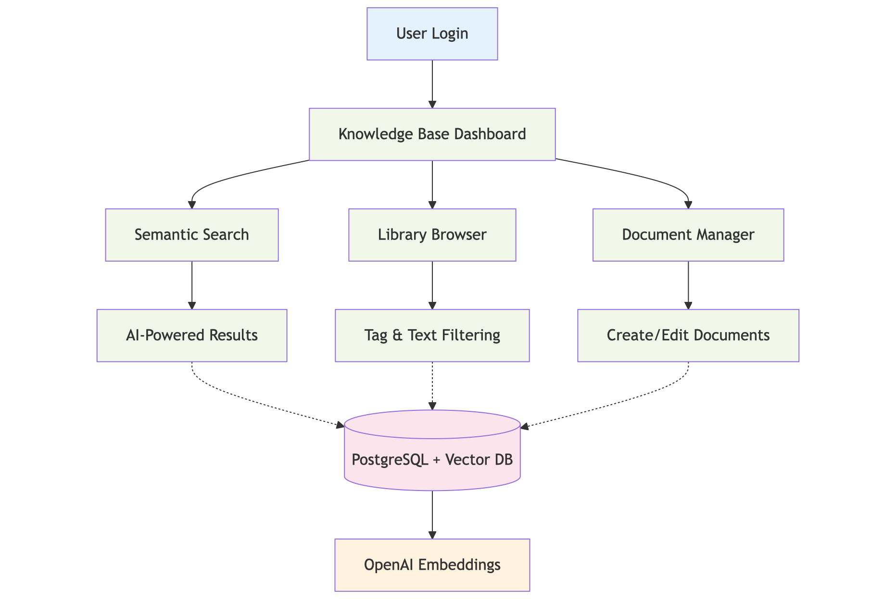

# KBHub - Full-Stack Next.js Application

A knowledge management system built with Next.js 15, React 19, and TypeScript. Features AI-powered semantic search using OpenAI embeddings and PostgreSQL vector extensions.

## Architecture Overview



## Project Requirements

| Requirement              | Implementation                         | Enhancement                     |
| ------------------------ | -------------------------------------- | ------------------------------- |
| **React & TypeScript**   | ✅ Next.js 15 + React 19 + TypeScript  | Server Components, App Router   |
| **Full-stack setup**     | ✅ Frontend + Backend with API routes  | Server Actions, Middleware      |
| **Database integration** | ✅ PostgreSQL with Prisma ORM          | Vector embeddings with pgvector |
| **State management**     | ✅ React hooks, URL state, Context API | Real-time search, form state    |

## Core Features

### AI-Powered Semantic Search

- **OpenAI Integration**: Documents are embedded using `text-embedding-3-small` for intelligent search
- **Vector Database**: PostgreSQL with pgvector extension for similarity matching
- **Smart Results**: Find content by meaning, not just keywords - ask "authentication help" and find "login tutorials"

### Dual Search Architecture

This approach provides the right tool for the user's intent: instant keyword/tag search for high-specificity lookups, and powerful semantic search for discovery and exploration.

- **Semantic Mode**: Natural language queries with vector similarity matching
- **Library Mode**: Tag-based filtering with autocomplete
- **Real-time Updates**: Debounced search with URL state persistence
- **Multi-tag Filtering**: Complex tag queries using `@` syntax

### Authentication System

- **NextAuth.js v5**: Credentials provider with session management
- **Security**: bcrypt password hashing, middleware-based route protection
- **Data Isolation**: User-specific data access patterns

### Data Layer

- **Type-Safe ORM**: Prisma with PostgreSQL for robust data management
- **Advanced Schema**: User relationships, document chunks for AI processing
- **Migrations**: Version-controlled database changes

## Technical Architecture

### Frontend Stack

- **Next.js 15 App Router**: Server and Client Components architecture
- **React 19**: Concurrent features with Suspense boundaries
- **TypeScript**: Full type safety across components and API calls
- **State Management**: React Context, URL state, custom hooks
- **UI Patterns**: Debounced search, skeleton loading states

### Backend Stack

- **Server Actions**: Direct database operations with type safety
- **API Routes**: RESTful endpoints with error handling
- **Middleware**: Authentication and route protection
- **Database**: PostgreSQL with Prisma ORM

### Implementation Details

- **Vector Search**: OpenAI embeddings with PostgreSQL pgvector extension
- **Document Processing**: Text chunking for optimal embedding performance
- **Search Interface**: Combined semantic and tag-based search
- **Performance**: Query optimization and code splitting

## Project Structure

```
├── app/
│   ├── auth/                 # Authentication pages
│   ├── dashboard/            # Protected application
│   │   ├── documents/        # CRUD operations
│   │   ├── library/          # Document management
│   │   └── search/           # AI-powered search
│   ├── lib/                  # Core business logic & server actions
│   │   ├── auth-actions.ts   # Authentication logic
│   │   ├── document-actions.ts # Document CRUD operations
│   │   ├── search-actions.ts   # AI search logic
│   │   ├── definitions.ts    # Shared TypeScript types
│   │   ├── embeddings.ts     # OpenAI integration
│   │   ├── utils.ts          # Shared utility functions
│   │   └── vector-db.ts      # Vector database queries
│   └── ui/                   # Reusable UI components
│       ├── dashboard/        # Components specific to dashboard pages
│       ├── shared/           # Reusable components (Buttons, Cards, etc.)
│       │   └── hooks/        # Reusable client-side logic
│       │       └── use-tag-autocomplete.ts
│       └── ...               # (Other UI folders omitted for brevity)
├── prisma/                   # Database schema & migrations
└── auth.config.ts           # Authentication setup
```

## Technical Implementation

### Technology Integration

- **Next.js App Router**: Server Components with React 19 features
- **Vector Database**: PostgreSQL pgvector for semantic search implementation
- **AI Integration**: OpenAI text-embedding-3-small for document vectorization

### Architecture Patterns

- **Custom Hooks for Logic Reusability**: Complex client-side logic, like the tag autocomplete feature, is extracted into custom hooks (e.g., `useTagAutocomplete`) to keep components clean and the logic reusable across the application.
- **State Management**: URL persistence, real-time search, form state handling
- **Performance**: Request debouncing, component optimization, efficient rendering
- **User Experience**: Loading states, error boundaries, responsive design

### Development Approach

- **Security**: Authentication, authorization, input validation
- **Code Quality**: TypeScript throughout, modular architecture
- **Maintainability**: Clear separation of concerns, organised file structure

## Setup Instructions

**Prerequisites**: Node.js, PostgreSQL with pgvector extension, OpenAI API key

```bash
# Clone and install
git clone <your-repo>
cd knowledge-base
pnpm install

# Set up environment
cp .env.example .env.local
# Add your DATABASE_URL, NEXTAUTH_SECRET, and OPENAI_API_KEY

# Set up database
# In PostgreSQL: CREATE EXTENSION IF NOT EXISTS vector;
pnpm prisma migrate dev

# Start the app
pnpm dev
```

Visit `http://localhost:3000` and start building your knowledge base!

## Usage

### Creating Content

1. Go to **Documents** and create your first note
2. Add tags like `@tutorial`, `@reference`, or `@project-notes`
3. Write in markdown - it's all searchable

### Search Functionality

- **Library View**: Filter by keywords and tags
- **Semantic Search**: Natural language queries using vector similarity
- **Tag Syntax**: Use `@tagname` for precise filtering

### Features

- **Tag Organization**: Consistent tagging improves searchability
- **Vector Search**: Works with descriptive, contextual content
- **URL Persistence**: Search states are preserved in browser navigation

## Deployment

Production deployment using Vercel:

1. Push repository to GitHub
2. Connect to Vercel
3. Configure environment variables: DATABASE_URL, NEXTAUTH_SECRET, OPENAI_API_KEY
4. Deploy

Ensure production PostgreSQL database includes pgvector extension.

---

**KBHub** - Document management with AI-powered search
